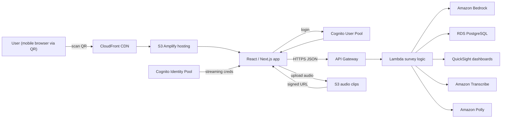
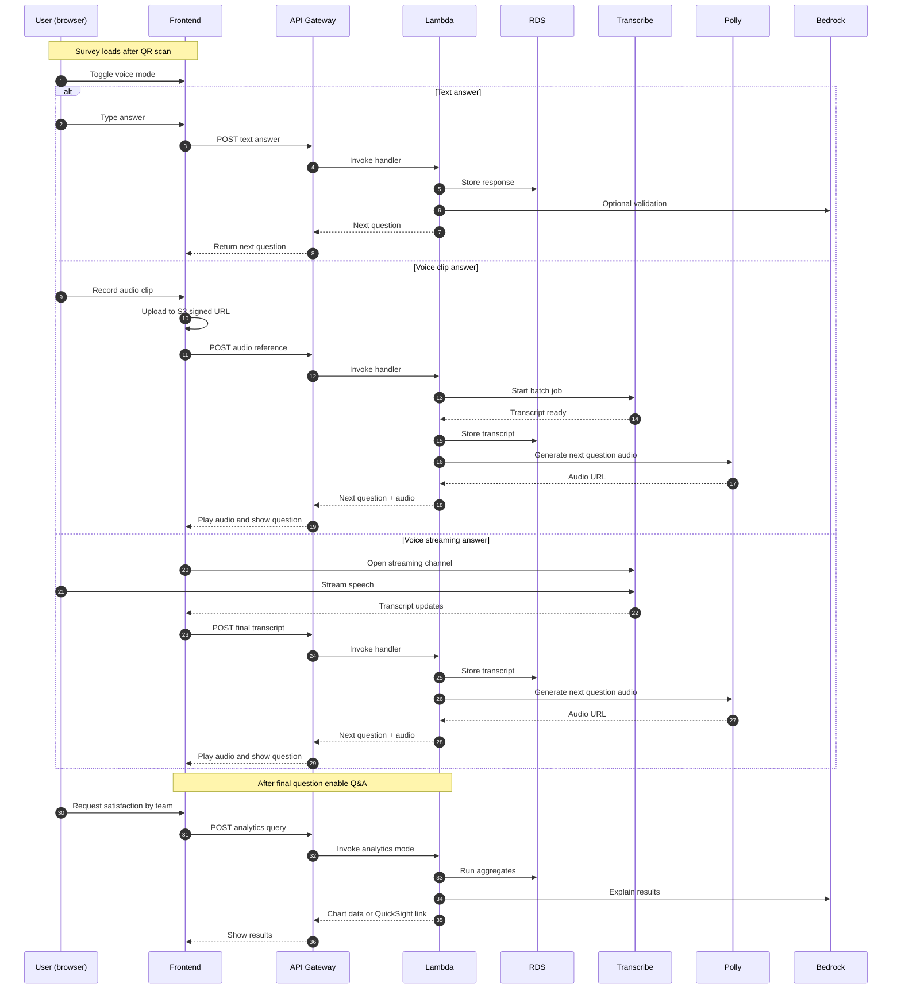
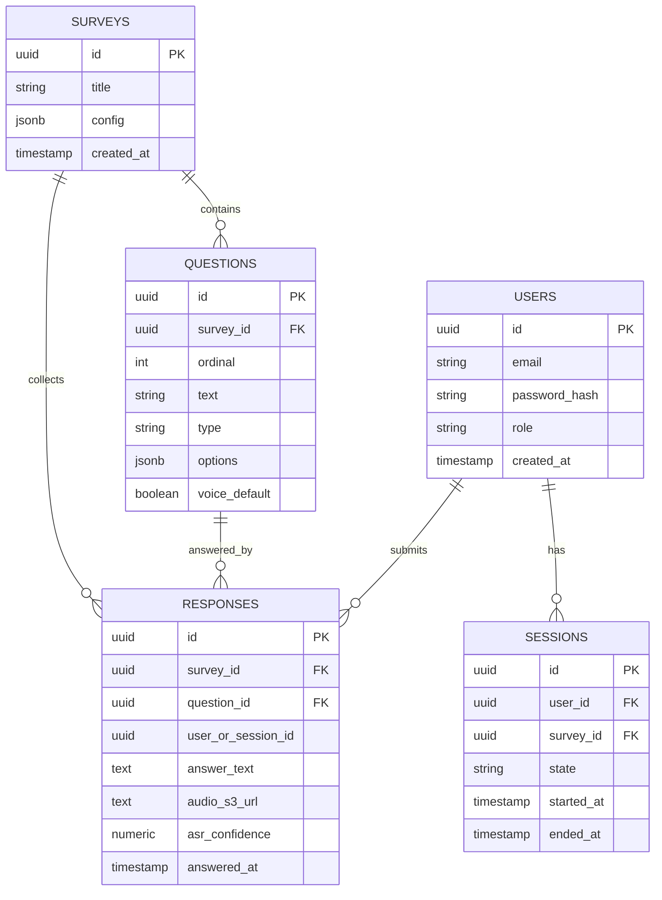

## 1 High-Level Architecture

```mermaid
graph LR
    U["User (mobile browser via QR)"]
    CF["CloudFront CDN"]
    S3Hosting["S3 Amplify hosting"]
    WebApp["React / Next.js app"]
    AuthUsers["Cognito User Pool"]
    AuthIdentity["Cognito Identity Pool"]
    ApiGateway["API Gateway"]
    SurveyLambda["Lambda survey logic"]
    Bedrock["Amazon Bedrock"]
    Transcribe["Amazon Transcribe"]
    Polly["Amazon Polly"]
    Database["RDS PostgreSQL"]
    AudioBucket["S3 audio clips"]
    Dashboards["QuickSight dashboards"]

    U -->|scan QR| CF
    CF --> S3Hosting
    S3Hosting --> WebApp
    WebApp -->|login| AuthUsers
    AuthUsers --> WebApp
    AuthIdentity -->|streaming creds| WebApp
    WebApp -->|HTTPS JSON| ApiGateway
    ApiGateway --> SurveyLambda
    SurveyLambda --> Bedrock
    SurveyLambda --> Database
    SurveyLambda --> Dashboards
    WebApp -->|upload audio| AudioBucket
    AudioBucket -->|signed URL| WebApp
    SurveyLambda --> Transcribe
    SurveyLambda --> Polly
```

## 2 Sequence: Per-Question (Text vs. Voice)

```mermaid
sequenceDiagram
    autonumber
    participant User as User (browser)
    participant App as Frontend
    participant Gateway as API Gateway
    participant Lambda as Lambda
    participant DB as RDS
    participant Transcribe as Transcribe
    participant Polly as Polly
    participant Bedrock as Bedrock

    Note over User,App: Survey loads after QR scan

    User->>App: Toggle voice mode

    alt Text answer
        User->>App: Type answer
        App->>Gateway: POST text answer
        Gateway->>Lambda: Invoke handler
        Lambda->>DB: Store response
        Lambda->>Bedrock: Optional validation
        Lambda-->>Gateway: Next question
        Gateway-->>App: Return next question
    else Voice clip answer
        User->>App: Record audio clip
        App->>App: Upload to S3 signed URL
        App->>Gateway: POST audio reference
        Gateway->>Lambda: Invoke handler
        Lambda->>Transcribe: Start batch job
        Transcribe-->>Lambda: Transcript ready
        Lambda->>DB: Store transcript
        Lambda->>Polly: Generate next question audio
        Polly-->>Lambda: Audio URL
        Lambda-->>Gateway: Next question + audio
        Gateway-->>App: Play audio and show question
    else Voice streaming answer
        App->>Transcribe: Open streaming channel
        User->>Transcribe: Stream speech
        Transcribe-->>App: Transcript updates
        App->>Gateway: POST final transcript
        Gateway->>Lambda: Invoke handler
        Lambda->>DB: Store transcript
        Lambda->>Polly: Generate next question audio
        Polly-->>Lambda: Audio URL
        Lambda-->>Gateway: Next question + audio
        Gateway-->>App: Play audio and show question
    end

    Note over App,Lambda: After final question enable Q&A
    User->>App: Request satisfaction by team
    App->>Gateway: POST analytics query
    Gateway->>Lambda: Invoke analytics mode
    Lambda->>DB: Run aggregates
    Lambda->>Bedrock: Explain results
    Lambda-->>Gateway: Chart data or QuickSight link
    Gateway-->>App: Show results
```

## 3 ER Model (Lean)

```mermaid
erDiagram
  USERS ||--o{ SESSIONS : has
  SURVEYS ||--o{ QUESTIONS : contains
  SURVEYS ||--o{ RESPONSES : collects
  QUESTIONS ||--o{ RESPONSES : answered_by
  USERS ||--o{ RESPONSES : submits

  USERS {
    uuid id PK
    string email
    string password_hash
    string role
    timestamp created_at
  }

  SESSIONS {
    uuid id PK
    uuid user_id FK
    uuid survey_id FK
    string state
    timestamp started_at
    timestamp ended_at
  }

  SURVEYS {
    uuid id PK
    string title
    jsonb config
    timestamp created_at
  }

  QUESTIONS {
    uuid id PK
    uuid survey_id FK
    int  ordinal
    string text
    string type
    jsonb options
    boolean voice_default
  }

  RESPONSES {
    uuid id PK
    uuid survey_id FK
    uuid question_id FK
    uuid user_or_session_id
    text answer_text
    text audio_s3_url
    numeric asr_confidence
    timestamp answered_at
  }
```
