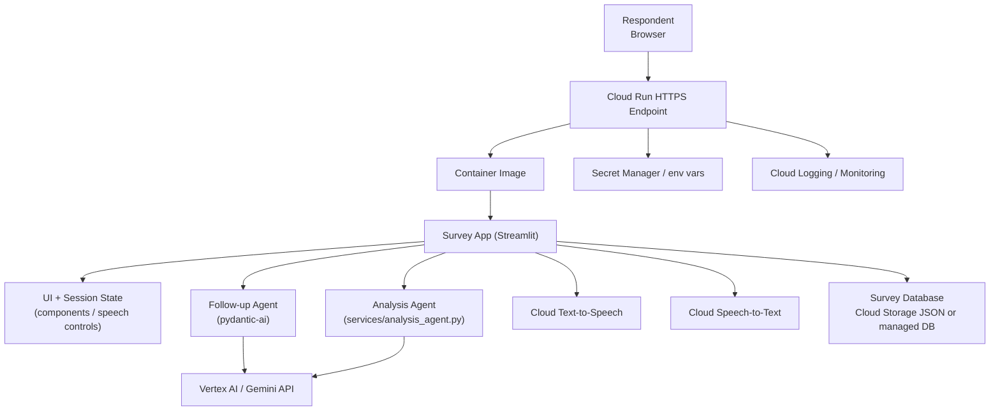
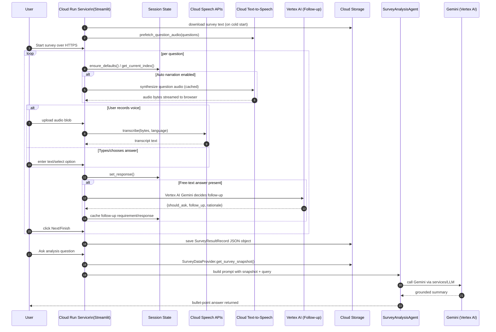
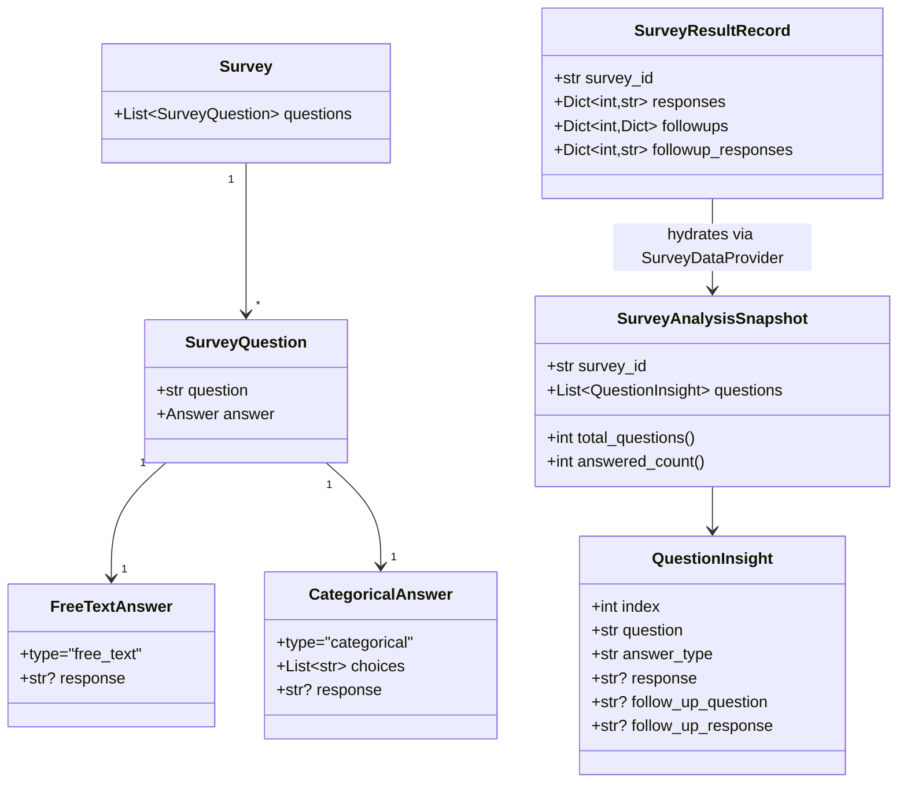

## 1 Cloud Deployment Architecture

Cloud Run hosts the containerized Streamlit survey app. The container bundles the UI, follow-up agent, and analysis agent, while Cloud Run’s managed runtime exposes HTTPS, injects secrets, and authenticates outbound calls to Google APIs. The running app fans out to Vertex AI (Gemini), Text-to-Speech, Speech-to-Text, and the configured survey database (Cloud Storage JSON today, swappable for a managed DB).

Key behaviors in Cloud Run:
- **Stateless compute, persistent storage** – Session progress remains inside Streamlit’s server cache, but durable survey responses are serialized through `SurveyResultRecord` into storage exposed to the container (`settings.survey_results_path` backed by Cloud Storage or a database).
- **Service account boundary** – Cloud Run’s identity controls access to Vertex AI, Speech APIs, Secret Manager, and the database bucket/service.
- **Speech pipeline** – `speech_controls.py` drives Google Text-to-Speech and Speech-to-Text via `GoogleSpeechService`.
- **LLM workloads** – Both agents call Gemini: `FollowUpAgent` uses PydanticAI’s `openai:` provider spec against Vertex AI, while `services/analysis_agent.py` routes through the shared `services/LLM.py` Gemini client.

## 2 Question & Analysis Flow on Cloud Run

- Navigation buttons always confirm follow-up completion before advancing. If an answer changes, dependent follow-up state is cleared and regenerated.
- Speech playback uses cache-aware IDs so toggling narration or moving across questions reuses synthesized bytes fetched from Cloud Text-to-Speech (and cached in the Cloud Run instance memory).
- Saving results writes directly to Cloud Storage (either via signed `gs://` paths or GCSFUSE). The analysis agent always reloads from this canonical blob before answering.

## 3 Data & Service Model

The project keeps the domain intentionally lean: questions are represented as `Survey` models, answers are simple strings or categorical choices, transient progress lives in Streamlit session state, and durable history is stored as JSON blobs in Cloud Storage until a managed database is added.

- **Survey input** – `app/services/survey_loader.py` parses the default text file while the in-app builder produces the same structure without touching disk.
- **Session state** – `app/UI/state.py` mirrors the in-progress survey into Streamlit’s server-side cache so answers survive reruns, page refreshes, and audio events even within Cloud Run’s stateless model.
- **Durable storage** – `MockSurveyDatabase` writes the `SurveyResultRecord` map to `SURVEY_RESULTS_PATH`, which should point at a Cloud Storage mount/path inside Cloud Run (or be swapped for Firestore/Spanner later).
- **Analysis snapshot** – `SurveyDataProvider` combines immutable survey metadata with whatever responses/follow-ups exist to produce `SurveyAnalysisSnapshot`, the only structure seen by `SurveyAnalysisAgent`.
- **Agent services** – `FollowUpAgent` and `SurveyAnalysisAgent` are intentionally thin adapters that translate domain objects into LLM prompts, keeping business logic testable without the models.

## 4 Cloud Run Operations

- **Service account & IAM** – Provide the Cloud Run revision with a dedicated service account that has `roles/aiplatform.user`, `roles/ml.admin` or the minimal Vertex AI permissions required for Gemini, plus `roles/speech.client`, `roles/secretmanager.secretAccessor`, and read/write access to the Cloud Storage bucket.
- **Secrets & config** – Store `LLM_API_KEY`, `LLM_MODEL`, and any speech overrides in Secret Manager or environment variables managed by Cloud Deploy; Cloud Run injects them before `app/core/config.py` initializes.
- **Networking** – Cloud Run accesses public Google APIs over the internet by default; if private access is required, attach a serverless VPC connector. Outbound calls are limited to Vertex AI and Speech APIs.
- **Scaling** – Streamlit benefits from higher concurrent request settings (Cloud Run concurrency 10–20) but speech synthesis/transcription is CPU-heavy, so set `--cpu=2` or greater and configure minimum instances to avoid cold-start latency.
- **Observability** – Streamlit logs flow automatically into Cloud Logging; integrate Cloud Monitoring alerts for speech/Vertex latency spikes and use Error Reporting for exceptions raised in `speech_controls.py` or `followups.py`.
